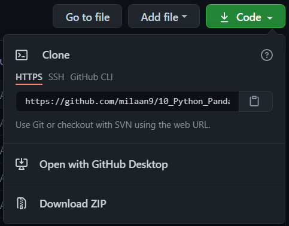

 
 
 
 

</a> 

 
<!---->

 

 
 
# 10_Python_Pandas_Module

## Introduction 👋

### What is Pandas in Python?
 is the most famous python library providing fast, flexible, and expressive data structures designed to make working with "relational" or "labeled" data both easy and intuitive. It aims to be the fundamental high-level building block for doing practical, **real world** data analysis in Python. Additionally, it has the broader goal of becoming **the most powerful and flexible open source data analysis / manipulation tool available in any language**. It is already well on its way towards this goal.

In Pandas, the data is usually utilized to support the statistical analysis in **SciPy**, plotting functions from **Matplotlib**, and machine learning algorithms in **Scikit-learn**.

## Main Features
Here are just a few of the things that pandas does well:

  - Easy handling of [**missing data**][missing-data] (represented as `NaN`) in floating point as well as non-floating point data
  - Size mutability: columns can be [**inserted and deleted**][insertion-deletion] from DataFrame and higher dimensional objects
  - Automatic and explicit [**data alignment**][alignment]: objects can be explicitly aligned to a set of labels, or the user can simply
    ignore the labels and let `Series`, `DataFrame`, etc. automatically align the data for you in computations
  - Powerful, flexible [**group by**][groupby] functionality to perform split-apply-combine operations on data sets, for both aggregating
    and transforming data
  - Make it [**easy to convert**][conversion] ragged, differently-indexed data in other Python and NumPy data structures
    into DataFrame objects
  - Intelligent label-based [**slicing**][slicing], [**fancy indexing**][fancy-indexing], and [**subsetting**][subsetting] of
    large data sets
  - Intuitive [**merging**][merging] and [**joining**][joining] datasets
  - Flexible [**reshaping**][reshape] and [**pivoting**][pivot-table] of datasets
  - [**Hierarchical**][mi] labeling of axes (possible to have multiple labels per tick)
  - Robust IO tools for loading data from [**flat files**][flat-files] (CSV and delimited), [**Excel files**][excel], [**databases**][db],
    and saving/loading data from the ultrafast [**HDF5 format**][hdfstore]
  - [**Time series**][timeseries]-specific functionality: date range generation and frequency conversion, moving window statistics,
    moving window linear regressions, date shifting and lagging, etc.

   [missing-data]: https://pandas.pydata.org/pandas-docs/stable/missing_data.html#working-with-missing-data
   [insertion-deletion]: https://pandas.pydata.org/pandas-docs/stable/dsintro.html#column-selection-addition-deletion
   [alignment]: https://pandas.pydata.org/pandas-docs/stable/dsintro.html?highlight=alignment#intro-to-data-structures
   [groupby]: https://pandas.pydata.org/pandas-docs/stable/groupby.html#group-by-split-apply-combine
   [conversion]: https://pandas.pydata.org/pandas-docs/stable/dsintro.html#dataframe
   [slicing]: https://pandas.pydata.org/pandas-docs/stable/indexing.html#slicing-ranges
   [fancy-indexing]: https://pandas.pydata.org/pandas-docs/stable/indexing.html#advanced-indexing-with-ix
   [subsetting]: https://pandas.pydata.org/pandas-docs/stable/indexing.html#boolean-indexing
   [merging]: https://pandas.pydata.org/pandas-docs/stable/merging.html#database-style-dataframe-joining-merging
   [joining]: https://pandas.pydata.org/pandas-docs/stable/merging.html#joining-on-index
   [reshape]: https://pandas.pydata.org/pandas-docs/stable/reshaping.html#reshaping-and-pivot-tables
   [pivot-table]: https://pandas.pydata.org/pandas-docs/stable/reshaping.html#pivot-tables-and-cross-tabulations
   [mi]: https://pandas.pydata.org/pandas-docs/stable/indexing.html#hierarchical-indexing-multiindex
   [flat-files]: https://pandas.pydata.org/pandas-docs/stable/io.html#csv-text-files
   [excel]: https://pandas.pydata.org/pandas-docs/stable/io.html#excel-files
   [db]: https://pandas.pydata.org/pandas-docs/stable/io.html#sql-queries
   [hdfstore]: https://pandas.pydata.org/pandas-docs/stable/io.html#hdf5-pytables
   [timeseries]: https://pandas.pydata.org/pandas-docs/stable/timeseries.html#time-series-date-functionality

### Core Components of Pandas Data Structure
Pandas have two core data structure components, and all operations are based on those two objects. Organizing data in a particular way is known as a data structure. Here are the two pandas data structures:

* **Series**
* **DataFrame**

---

## Table of contents 📋

| **No.** | **Name** | 
| ------- | -------- | 
| 01 | **[Python_Pandas_DataFrame](https://github.com/milaan9/10_Python_Pandas_Module/blob/main/001_Python_Pandas_DataFrame.ipynb)** |
|    | 1.1 **[001_Python_Pandas_DataFrame_from_Dictionary](https://github.com/milaan9/10_Python_Pandas_Module/blob/main/001_Python_Pandas_Methods/001_Python_Pandas_DataFrame_from_Dictionary.ipynb)** |
|    | 1.2 **[Python_Pandas_DataFrame_from_List](https://github.com/milaan9/10_Python_Pandas_Module/blob/main/001_Python_Pandas_Methods/002_Python_Pandas_DataFrame_from_List.ipynb)** |
|    | 1.3 **[Python_Pandas_DataFrame_head()_and_tail()](https://github.com/milaan9/10_Python_Pandas_Module/blob/main/001_Python_Pandas_Methods/003_Python_Pandas_DataFrame_head()_and_tail().ipynb)** |
|    | 1.4 **[004_Python_Pandas_DataFrame_drop_columns](https://github.com/milaan9/10_Python_Pandas_Module/blob/main/001_Python_Pandas_Methods/004_Python_Pandas_DataFrame_drop_columns.ipynb)** |
|    | 1.5 **[Python_Pandas_DataFrame_drop_duplicates](https://github.com/milaan9/10_Python_Pandas_Module/blob/main/001_Python_Pandas_Methods/005_Python_Pandas_DataFrame_drop_duplicates.ipynb)** |
|    | 1.6 **[Python_Pandas_DataFrame_drop_columns_with_NA](https://github.com/milaan9/10_Python_Pandas_Module/blob/main/001_Python_Pandas_Methods/006_Python_Pandas_DataFrame_drop_columns_with_NA.ipynb)** |
|    | 1.7 **[Python_Pandas_DataFrame_rename_columns](https://github.com/milaan9/10_Python_Pandas_Module/blob/main/001_Python_Pandas_Methods/007_Python_Pandas_DataFrame_rename_columns.ipynb)** |
|    | 1.8 **[Python_Pandas_DataFrame_to_Python_dictionary](https://github.com/milaan9/10_Python_Pandas_Module/blob/main/001_Python_Pandas_Methods/008_Python_Pandas_DataFrame_to_Python_dictionary.ipynb)** |
|    | 1.9 **[Python_Pandas_DataFrame_set_index](https://github.com/milaan9/10_Python_Pandas_Module/blob/main/001_Python_Pandas_Methods/009_Python_Pandas_DataFrame_set_index.ipynb)** |
|    | 1.10 **[Python_Pandas_DataFrame_reset_index](https://github.com/milaan9/10_Python_Pandas_Module/blob/main/001_Python_Pandas_Methods/010_Python_Pandas_DataFrame_reset_index.ipynb)** |
| 02 | **[Python_Pandas_Exercise_1](https://github.com/milaan9/10_Python_Pandas_Module/blob/main/002_Python_Pandas_Exercise_1.ipynb)** |
| 03 | **[Python_Pandas_Exercise_2](https://github.com/milaan9/10_Python_Pandas_Module/blob/main/003_Python_Pandas_Exercise_2.ipynb)** |
|    | **[automobile_data.csv](https://github.com/milaan9/10_Python_Pandas_Module/blob/main/automobile_data.csv)** |
|    | **[pokemon_data.csv](https://github.com/milaan9/10_Python_Pandas_Module/blob/main/pokemon_data.csv)** |
| 04 | **[Pandas Cheat Sheet Data Wrangling in Python.pdf](https://github.com/milaan9/10_Python_Pandas_Module/blob/main/Pandas%20Cheat%20Sheet%20Data%20Wrangling%20in%20Python.pdf)** |
| 05 | **[Pandas Cheat Sheet for Data Science in Python.pdf](https://github.com/milaan9/10_Python_Pandas_Module/blob/main/Pandas%20Cheat%20Sheet%20for%20Data%20Science%20in%20Python.pdf)** |

These are online **read-only** versions. However you can **`Run ▶`**  all the codes **online** by clicking here ➞ 

---

## Install Pandas Module:

Open your  Prompt  and type and run the following command (individually):

 -       pip install pandas  
 

Once Installed now we can import it inside our python code.

---  

## Frequently asked questions ❔

### How can I thank you for writing and sharing this tutorial? 🌷

You can  and  Starring and Forking is free for you, but it tells me and other people that it was helpful and you like this tutorial.

Go [**`here`**](https://github.com/milaan9/10_Python_Pandas_Module) if you aren't here already and click ➞ **`✰ Star`** and **`ⵖ Fork`** button in the top right corner. You'll be asked to create a GitHub account if you don't already have one.

---

### How can I read this tutorial without an Internet connection? 

1. Go [**`here`**](https://github.com/milaan9/10_Python_Pandas_Module) and click the big green ➞ **`Code`** button in the top right of the page, then click ➞ [**`Download ZIP`**](https://github.com/milaan9/10_Python_Pandas_Module/archive/refs/heads/main.zip).

    

2. Extract the ZIP and open it. Unfortunately I don't have any more specific instructions because how exactly this is done depends on which operating system you run.
    
3. Launch ipython notebook from the folder which contains the notebooks. Open each one of them
  
    **`Kernel > Restart & Clear Output`**
    
This will clear all the outputs and now you can understand each statement and learn interactively.

If you have git and you know how to use it, you can also clone the repository instead of downloading a zip and extracting it. An advantage with doing it this way is that you don't need to download the whole tutorial again to get the latest version of it, all you need to do is to pull with git and run ipython notebook again.

---

## Authors ✍️

I'm Dr. Milaan Parmar and I have written this tutorial. If you think you can add/correct/edit and enhance this tutorial you are most welcome🙏

See [github's contributors page](https://github.com/milaan9/10_Python_Pandas_Module/graphs/contributors) for details.

If you have trouble with this tutorial please tell me about it by [Create an issue on GitHub](https://github.com/milaan9/10_Python_Pandas_Module/issues/new). and I'll make this tutorial better. This is probably the best choice if you had trouble following the tutorial, and something in it should be explained better. You will be asked to create a GitHub account if you don't already have one.

If you like this tutorial, please [give it a ⭐ star](https://github.com/milaan9/10_Python_Pandas_Module).

---

## Licence 📜

You may use this tutorial freely at your own risk. See [LICENSE](./LICENSE).

